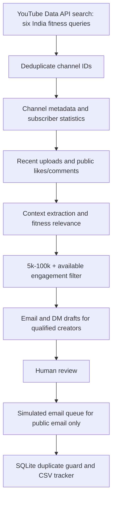

# Prototype workflow

```mermaid
flowchart TD
  A[YouTube Data API search: six India fitness queries] --> B[Deduplicate channel IDs]
  B --> C[Channel metadata and subscriber statistics]
  C --> D[Recent uploads and public likes/comments]
  D --> E[Context extraction and fitness relevance]
  E --> F[5k-100k + available engagement filter]
  F --> G[Email and DM drafts for qualified creators]
  G --> H[Human review]
  H --> I[Simulated email queue for public email only]
  I --> J[SQLite duplicate guard and CSV tracker]
```

Email and DM delivery is intentionally simulated. Public email is not inferred when absent, and DM automation is not attempted.
